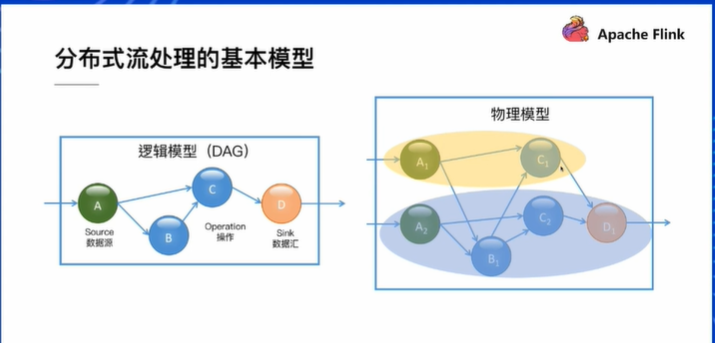
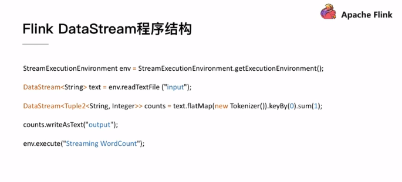
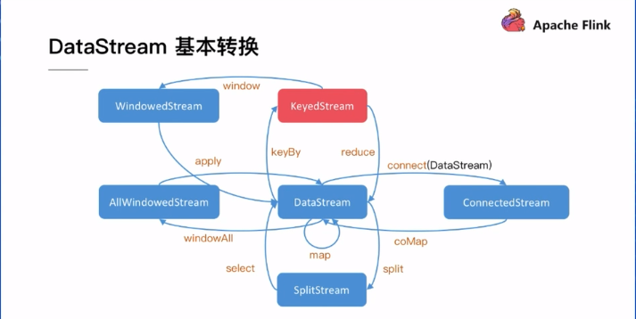
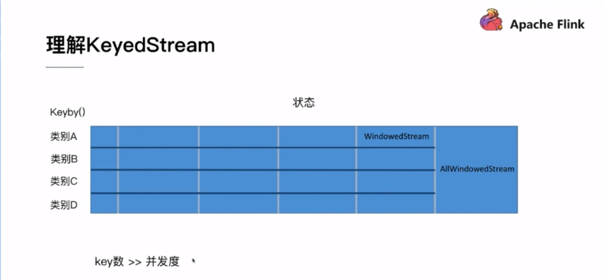
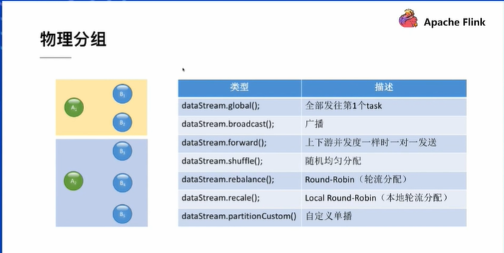
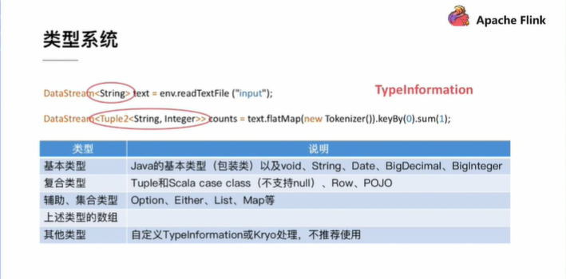
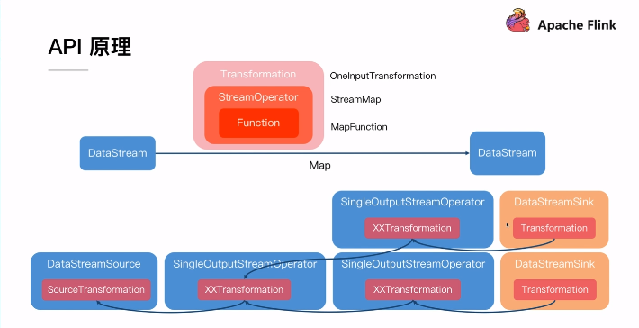
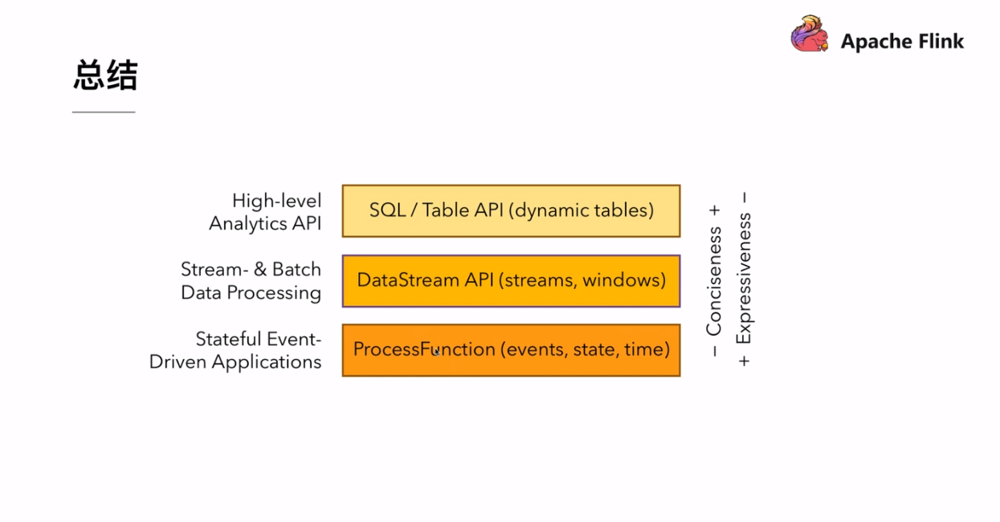

#### 理论部分
+ 流处理:数据驱动，数据无边界
+ Flink:分布式流处理系统
    + 逻辑模型(DAG图)
        - 结点：算子   Source->OPeration->Sink
    + 物理模型
        - 每个算子可能有多个实例，不同算子的不同实例之间进行数据传输
        - 不同的实例会分布在不同的节点(集群)上

+ 基本DataStreaming程序结构
    - 设置运行环境 StreamExecutionEnvironment.getExecutionEnvironment()
    - 配置数据源读取数据 env.readTextFile()
    - 进行相应的数据操作 text.flatMap()等
    - 配置数据汇Sink写出数据 writeAsText()
    - 提交执行(以上部分相当于在画图) env.execute()
    

#### API操作概览
+ 基于单条记录
    - filter
    - map 
+ 基于窗口 例：一段时间的数据
    - window
+ 合并多条流
    - union
    - join
    - connect
+ 拆分单条流
    - split (旁路输出？)

#### API操作概览2
+ DataStream->DataStream
    - map
    - flatmap
    - filter

#### DataStream基本转换

> 红色是常用操作

+ 理解KeyedStream-核心
    - 将一条数据流切分为AllwindowsedStream
    - 分布式原则:
        + 通过keyby()将不同类别的数据放到不同的结点上去执行
        + key数远大于并发度，这样才能更好地体现分布式的特征

+ 物理分组-Partition 分区
    - global() 全部发往下游的第一个Task
    - broadcast() 把算子A的数据复制多份发往B的所有Task
    - forward() 一对一
    - shuffle() 从下游的算子B随机选一个Task发送
    - rebalance() 对下游的算子B中轮流选择Task发送
    - recale() 只能对本机的下游算子B的结点进行轮流选择Task发送
    - partitionCustom() ？

+ 类型系统
    - 尽量用Flink内置的数据类型
    - Tuple2比较常用

+ API原理

+ API总结

