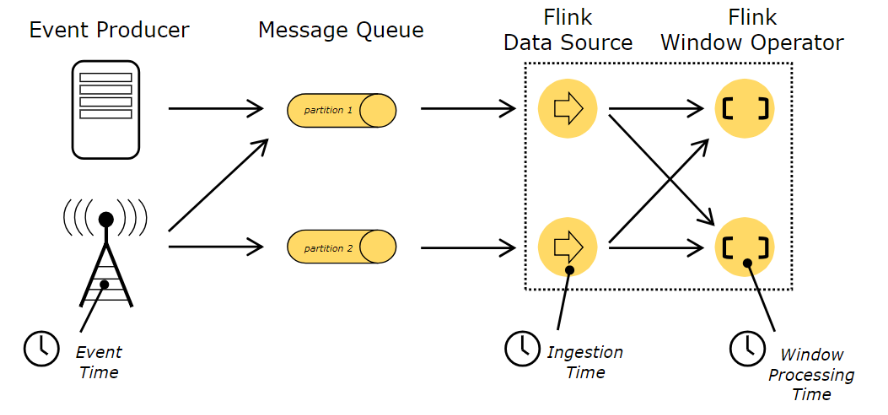
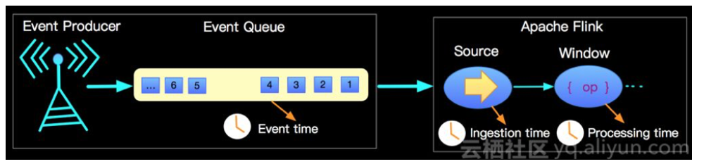

### 1 时间类型
+ 事件时间 EventTime 
+ 摄入时间 IngesingtTime
+ 处理时间 ProcessingTime
具体时间类型含义见下图，我们可以根据不同的时间来划分不同的Window

### 2 Event Time
+ 事件发生的时间(事件时间戳)
+ 数据本身携带，在到达Flink之前就确定的
+ Event Time 程序必须指定如何`生成 Event Time 水印`，这是表示 Event Time 进度的机制。？

> 无论事件什么时候到达或者其怎么排序，最后处理 Event Time 将产生完全一致和确定的结果

> `特殊情况`:事件到达是乱序的，则Flink处理程序就需要等待一定时间(延迟)，但在有限时间内还是无法到达的话，则就无法保证确定的结果

### 3 IngesingtTime
+ 事件进入Flink的时间，即加载到DataSource的时间，Source会为其分配时间戳
#### 3.1 与Event Time对比
+ 与 Event Time 相比，Ingestion Time 程序无法处理任何无序事件或延迟数据，但程序不必指定如何生成水印。
+ 在Flink中，Ingestion Time 与 Event Time 非常相似，但 Ingestion Time 具有自动分配时间戳和自动生成水印功能。

### 4 ProcessingTime
+ 事件被处理时机器的系统时间
+ 事件到达特定操作的系统时间

> 例如，如果应用程序在上午 9:15 开始运行，则第一个每小时 Processing Time 窗口将包括在上午 9:15 到上午 10:00 之间处理的事件，下一个窗口将包括在上午 10:00 到 11:00 之间处理的事件。

Processing Time 是最简单的 “Time” 概念，不需要流和机器之间的协调，它提供了最好的性能和最低的延迟。但是，在分布式和异步的环境下，Processing Time 不能提供确定性，因为它容易受到事件到达系统的速度事件在系统内操作流动的速度以及中断的影响,所以`同一个数据流在Porcessing time上的windows划分结果是不同的`。

