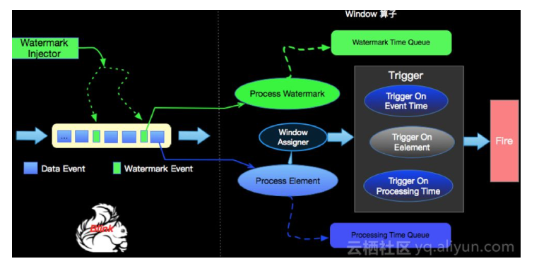

#### Watermark-水印
+ 为了处理`EventTime窗口`计算提出的一种机制
> EventTime window 计算条件是当Window计算的Timer时间戳 小于等于 当前系统的Watermak的时间戳时候进行计算
+ 本质是时间戳
+ 由Apache Flink Source或者自定义的Watermark生成器按照需求Punctuated或者Periodic两种方式生成的一种`系统Event`
+ 接收到Watermark Event的算子以此不断调整自己管理的EventTime clock
+ Apache Flink 框架保证Watermark单调递增，算子接收到一个Watermark时候，框架知道不会再有任何小于该Watermark的时间戳的数据元素到来了，所以Watermark可以看做是告诉Apache Flink框架数据流已经处理到什么位置(时间维度)的方式。

#### 水印的产生方式
+ Punctuated
    - 数据流中每一个递增的EventTime都会产生一个Watermark 
    - 会产生大量的Watermark在一定程度上对下游算子造成压力
    - `实时性要求非常高`的场景才会选择Punctuated的方式进行Watermark的生成
+ Periodic 
    - 周期性的（一定时间间隔或者达到一定的记录条数）产生一个Watermark。
    - 实际的生产中Periodic的方式必须结合时间和积累条数两个维度继续周期性产生Watermark`？`，否则在极端情况下会有很大的延时

#### 注意的问题
+ Event中的EventTime自产生那一刻起就不可以改变了，不受Apache Flink框架控制
+ 而Watermark的产生是在Apache Flink的Source节点或实现的Watermark生成器计算产生
+ 若正常策略为Watermark = EventTime，但是该Data迟到了x，则Watermark就大了x，则正确处理策略为Watermark=EventTime-x，这样Watermark就进入了对应EventTime窗口Timer的时间范围内，可以被正确处理

#### 多流的水印处理过程
- 多流：即一个job含有多个dataSource
- 问题：对不同Source的数据如果进行GroupBy分组，那么来自不同Source的相同key值会shuffle到同一个处理节点，并携带各自的Watermark，Apache Flink内部要保证Watermark要保持单调递增，多个Source的Watermark汇聚到一起时候可能不是单调自增的，这样的情况Apache Flink内部是如何处理的呢？
- 解决：Apache Flink会选择所有流入的Eventtime中最小的一个向下游流出。从而保证watermark的单调递增和保证数据的完整性.

