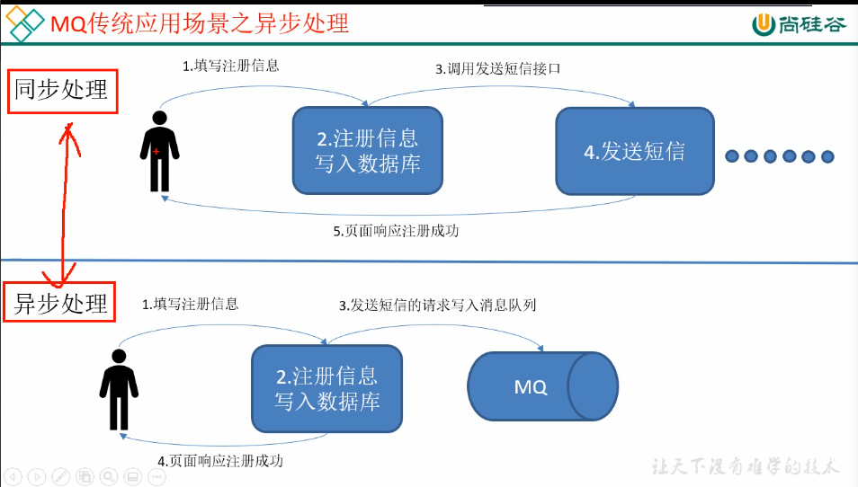
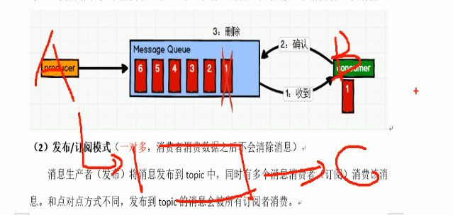

#### kafka概述
+ 消息队列 Message Queue(MQ) `分布式`
+ A->B 通信使用kafka做一个中间件
+ 大数据实时处理
+ 发布/订阅？

#### 消息队列
+ 异步处理
+ 解耦:将两种运动分离开来处理问题
+ 可恢复: A->B通信，即使B挂了，A发送的信息也可以暂存MQ
+ 削峰：使关键组件挺住突发的访问压力，不会超负荷(平时服务器资源不可能按照峰值来分配)
+ 缓冲：处理生产速度和消费速度不一致(大部分:生产>消费)

[参考链接](https://www.cnblogs.com/yuanjiangw/p/10382423.html)

#### 消息队列的两种模式
+ 点对点模式
    一对一 不可复用 给多个人发送会很麻烦

+ 发布/订阅模式(2种)

    一对多:生产者将消息发布到Topic，则消息会被订阅的消费者接受
    - 消费者主动拉取数据(消费速度由消费者本身速度决定)
        + 缺点：浪费资源，维持一个消息询问
    - Topic主动向下游的消费者推(消费速度由Topic决定)
        + 缺点: 速度由Topic决定，消费者的处理速度可能会与其不匹配，造成资源浪费或超出负荷

    

    
