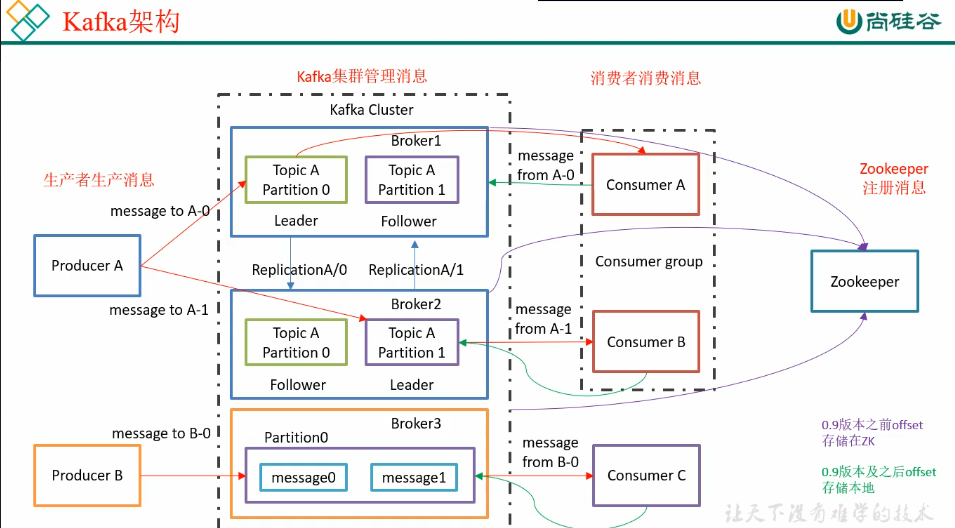
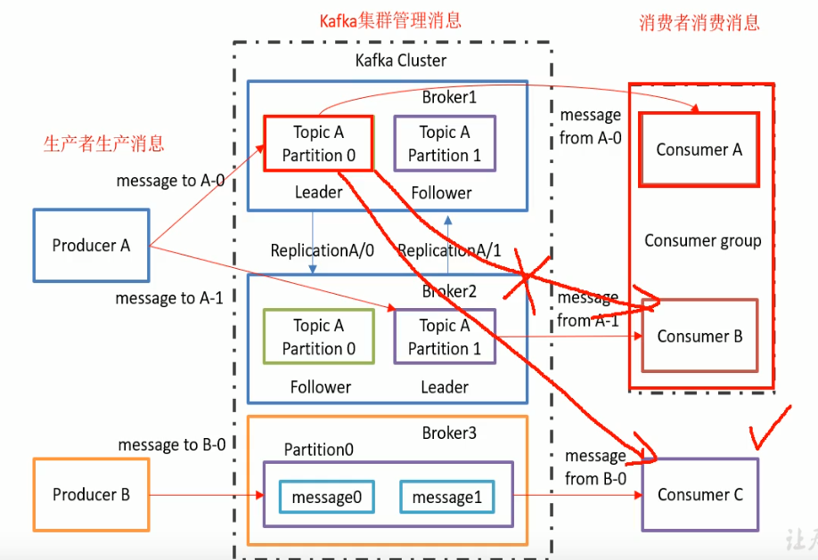
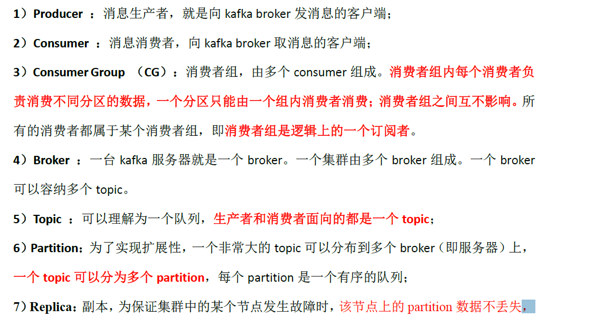
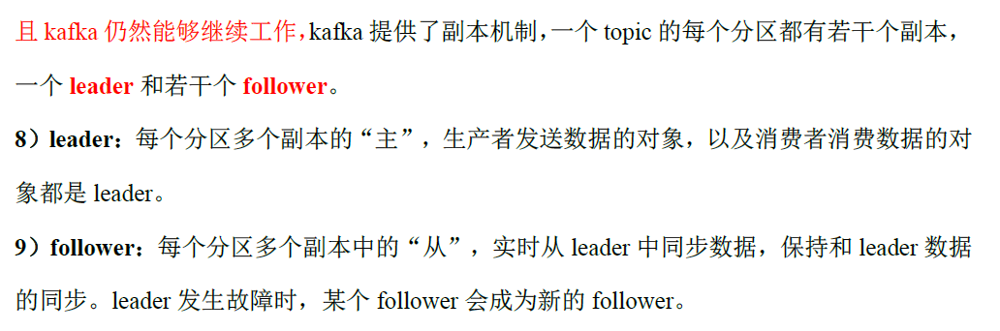

#### 架构

+ kafka集群Cluster
    - 1个Cluster多个Broker(分布式)
        + 一个Broken含有多个Topic(主题/对消息做分类)
            - 一个Topic的数据会存储到不同的Partition上(提高负载能力和并发度)
                + 每个partition由leader进行管理和生产消费交互

+ Consumer group(消费者族)
    - 可以理解为一个大的消费者，提高了并发度(下面就比较好理解)
    - 某一个Partition的消息只能被同一个Consumer group的`某一个`消费者所消费
    - 最好的状态：Consumer group里消费者个数与所订阅的Topic的Partition数相同

+ Topic:是Kafka下`消息的类别`。这是逻辑上的概念，用来区分、隔离不同的消息数据，屏蔽了底层复杂的存储方式

+ Partition：是Kafka下`数据存储`的基本单元，这个是物理上的概念。同一个topic的数据，会被分散的存储到多个partition中，这些partition可以在同一台机器上，也可以是在多台机器上

+ leader
    ？
+ follwer
    - leader的备份/副本，冗余信息，保证分布式集群的高可靠性
    - 与所属的leader一定不再同一个Broker上
    - 如果有一个leader宕机了，那么它对应的follwer就会提升为leader
    - 仅在leader损坏时发挥作用

+ Zookeeper
    - 帮kafka集群存储一些信息(让不同的Broker知道自己属于同一集群)
    - 保存每个Consumer读取消息的位置信息(便于消费者故障重启后继续读取)`0.9版本前`(见架构图右下角)

